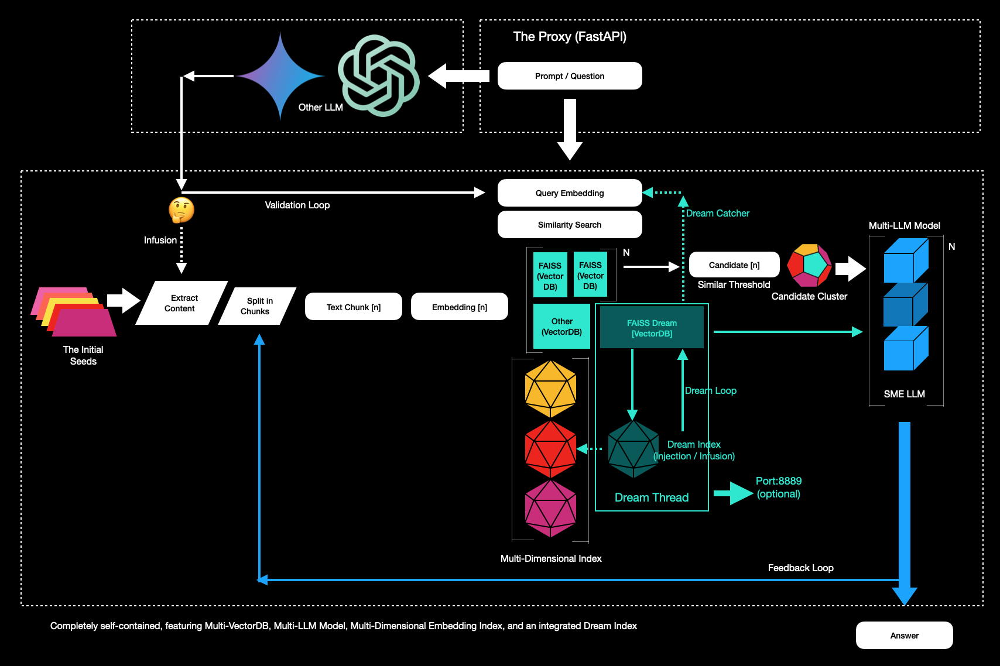

# Collective Intelligence and the Dream-Injector

- Dare to Dream
- Inspire Bold Leadership
- Embrace Diversity in Thought and Innovation
- Explore together & unlock the world's knowledge

------------------------------

Completely self-contained, featuring Multi-VectorDB, Multi-LLM Model, Multi-Dimensional Embedding Index, and an integrated Dream Index

------------------------------

This POC represents a significant advancement,  presenting innovative ideas for creating intelligent systems that are both adaptive and collaborative. With the fusion of RAG with collective intelligence through VectorDB sets a new standard for dynamic and interactive AI solutions, particularly with the implementation of Dream-Injector. Meanwhile, Dream-Infusion continues to be an emerging concept, poised for further exploration. 

This collaborative environment allows for dynamic learning and adaptation, with each vectorDB-state contributing to a shared pool of knowledge and insights. The system's ability to leverage FAISS ensures that it remains responsive and adaptable to new information and evolving contexts, including the injection of State-Dreams. The concept of a "State of Dreams" could represent a broader condition where the entire state-machine operates within a framework that fosters creativity, speculation, and the exploration of ideas beyond conventional logic.

As the Dream-Injector introduces new, creative inputs, it influences the connections between nodes, effectively reshaping the relationships and hierarchies within the network. This process allows the system to explore a wider range of solutions, uncover hidden patterns, and innovate beyond standard computational methods. The dynamic weighting of nodes, influenced by the Dream-Injector, ensures that the system continually evolves, pushing the boundaries of what is possible in both problem-solving and creative thinking, yet still influenced by the seeds.  

Keywords: Collective Intelligence, Vectors, VectorDB, Consciousness, Artificial Intelligence, RAG, ANN, Inclusivity, Machine Learning, Data Assimilation, Borg.